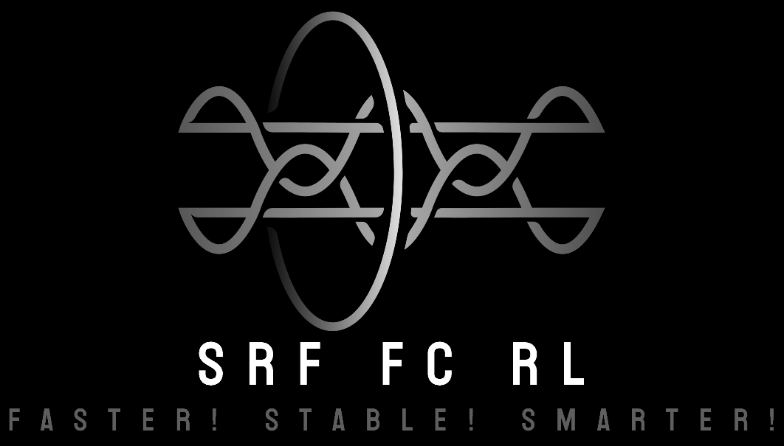

[](https://github.com/iuming/SRF_FC_RL/stargazers)
[](LICENSE)
[](https://github.com/iuming/SRF_FC_RL/commits/master)
[](https://github.com/iuming/SRF_FC_RL/pulls)

# Superconducting RadioFrequency cavity Frequency Control by Reinforcement Learning

Control the frequency of the particle accelerator's radio frequency superconducting cavity based on reinforcement learning algorithm.


## Project Structure

Describe the directory structure of the project to help users understand the files and folders included in the project.

```
SRF_FC_RL/
├── config/       # Configuration files
├── envs/         # Environment implementations
├── models/       # Trained models
├── scripts/      # Training/Evaluation scripts
├── utils/        # Utility modules
├── README.md     # Project documentation
└── requirements.txt # Dependency list
```

## Installation Guide

- Install conda 
- (Suggested) Create a virtual environment and activate it
- Install dependencies

1. Create a virtual environment:
```bash
conda create -n RL python==3.13.2
conda activate RL
```

2. Install dependencies:
```bash
pip install -r requirements.txt
```

## Train the Model
```bash
python scripts/train.py --config config/config.yaml
```

## Evaluate the Model
```bash
python scripts/evaluate.py --config config/config.yaml
```

## Notes
1. Ensure that the CUDA environment is installed to enable GPU acceleration.
2. Parameters in the configuration file can be adjusted based on actual requirements.
3. Visualization results will automatically pop up after evaluation is completed.

## Contributing
We welcome contributions to this project! To contribute, please follow these steps:

1. **Fork the Repository**: Click the "Fork" button at the top right of this repository to create your own copy.
2. **Clone the Repository**: Clone your forked repository to your local machine.
    ```bash
    git clone https://github.com/your-username/SRF_FC_RL.git
    cd SRF_FC_RL
    ```
3. **Create a Branch**: Create a new branch for your feature or bug fix.
    ```bash
    git checkout -b feature-name
    ```
4. **Make Changes**: Implement your changes and commit them with clear and concise commit messages.
    ```bash
    git add .
    git commit -m "Description of changes"
    ```
5. **Push Changes**: Push your changes to your forked repository.
    ```bash
    git push origin feature-name
    ```
6. **Submit a Pull Request**: Open a pull request to the main repository. Provide a detailed description of your changes and why they should be merged.

### Contribution Guidelines
- Ensure your code follows the project's coding standards.
- Write clear and concise documentation for any new features or changes.
- Test your changes thoroughly before submitting a pull request.
- Be respectful and constructive in code reviews and discussions.

### Contact
If you have any questions or need assistance, feel free to reach out:
- **Email**: [ming-1018@foxmail.com](mailto:ming-1018@foxmail.com)
- **GitHub Issues**: [Open an issue](https://github.com/iuming/SRF_FC_RL/issues)

We appreciate your interest in contributing and look forward to your input!

## License

This repository is licensed under the [LICENSE](LICENSE).

## Contact

For any inquiries or support, you can reach out through the following channels:

- **Email**: [ming-1018@foxmail.com](mailto:ming-1018@foxmail.com)
- **GitHub Issues**: [Submit an issue](https://github.com/iuming/SRF_FC_RL/issues)
- **Discussion Forum**: [GitHub Discussions](https://github.com/iuming/SRF_FC_RL/discussions)

Thank you for your interest in this project, and we hope you find it helpful and inspiring!

## Star History

[](https://star-history.com/#iuming/SRF_FC_RL&Date)

