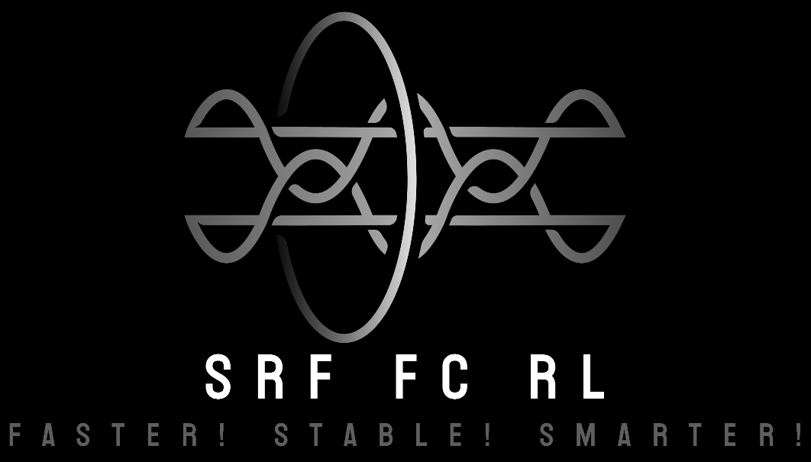

[](https://github.com/iuming/SRF_FC_RL/stargazers)
[](LICENSE)
[](https://github.com/iuming/SRF_FC_RL/commits/master)
[](https://github.com/iuming/SRF_FC_RL/pulls)
[](https://www.python.org/downloads/)
[](https://github.com/iuming/SRF_FC_RL/actions)
[](docs/user_manual.rst)

# Superconducting RadioFrequency cavity Frequency Control by Reinforcement Learning

This project implements a reinforcement learning system for controlling RF (Radio Frequency) cavity systems using PPO (Proximal Policy Optimization). The agent learns to minimize frequency detuning through piezo-based frequency control.

## Project Structure

```
.
├── main.py                 # Main entry point
├── src/                    # Source code
│   └── rf_cavity_env.py   # RF cavity environment implementation
├── scripts/                # Training and testing scripts
│   ├── train_rf_cavity.py # Training script
│   ├── test_rf_cavity.py  # Testing and evaluation script
│   └── test_environment.py # Environment testing
├── configs/                # Configuration files
│   └── config.py          # Environment and training configurations
├── best_model/            # Best trained models
├── models/                # All trained models
├── logs/                  # Training logs
├── results/               # Test results and plots
└── ppo_rf_cavity_tensorboard/ # Tensorboard logs
```

## Features

### Environment (`RFCavityControlEnv`)
- **Observation Space**: 4D continuous space
  - Cavity voltage amplitude (MV)
  - Reflected voltage amplitude (MV)
  - Cavity voltage phase (degrees)
  - Frequency detuning (kHz)

- **Action Space**: 1D continuous space
  - Piezo control signal [-2.0, 2.0]

- **Reward Function**: Negative absolute frequency detuning (encourages minimizing detuning)

### Key Components
- **RF Source Simulation**: Models RF signal generation
- **I/Q Modulator**: Handles pulsed/CW operation modes
- **RF Amplifier**: Simulates signal amplification
- **Cavity Dynamics**: Includes mechanical modes and beam loading effects
- **Piezo Control**: Frequency control through piezo actuators
- **Real-Time Interface**: Live monitoring and manual control capabilities

## Installation

1. Ensure you have the required dependencies:
```bash
pip install gymnasium stable-baselines3 matplotlib numpy
```

2. Install the LLRF libraries (required for RF simulation):
```bash
# Install llrflibs according to your system requirements
```

## Usage

### Quick Start

Test the environment:
```bash
python main.py env-test
```

Train a new model:
```bash
python main.py train
```

Test a trained model:
```bash
python main.py test
```

Real-time control (command line):
```bash
python main.py realtime
```

Real-time control (GUI):
```bash
python main.py realtime-gui
```

#### Windows用户
```bash
# 双击运行批处理文件
train.bat           # 训练
test.bat            # 测试  
realtime.bat        # 实时控制 (命令行)
realtime_gui.bat    # 实时控制 (GUI)
```

### Advanced Usage

#### Training
```bash
cd scripts
python train_rf_cavity.py
```

Training features:
- PPO algorithm with customizable hyperparameters
- Vectorized environments for parallel training
- Early stopping based on reward threshold
- Automatic model saving and evaluation
- Tensorboard logging for monitoring

#### Testing and Evaluation
```bash
cd scripts
python test_rf_cavity.py
```

Testing features:
- Model performance evaluation over multiple episodes
- Detailed demonstration with data logging
- Comprehensive visualization of control performance
- Performance analysis and statistics

#### Real-Time Control
```bash
cd scripts
python realtime_simple.py    # Command line interface
python realtime_gui.py       # GUI interface
```

Real-time control features:
- Live monitoring of RF cavity parameters
- Manual control intervention
- Automatic control with trained models
- Real-time data logging and visualization
- Pause/resume/reset simulation capabilities
- Export data for analysis

#### Environment Testing
```bash
cd scripts
python test_environment.py
```

Verifies that the environment:
- Initializes correctly
- Produces valid observations and rewards
- Handles actions properly
- Doesn't generate NaN or infinite values

## Real-Time Control Interface

The system includes two real-time control interfaces for live monitoring and manual intervention:

### Command Line Interface
A lightweight terminal-based interface for real-time control:

```bash
python main.py realtime
# or
cd scripts && python realtime_simple.py
```

Features:
- **Live monitoring**: Real-time display of cavity parameters
- **Manual control**: Direct piezo action input
- **Automatic control**: Use trained RL models
- **Simulation control**: Start/pause/reset/stop
- **Status reporting**: Periodic performance updates

Commands:
- `a` - Enable automatic control (requires loaded model)
- `m` - Enable manual control mode
- `o` - Turn off all control
- `p` - Pause/resume simulation
- `r` - Reset simulation
- `s` - Show detailed status
- `q` - Quit

### GUI Interface
A comprehensive graphical interface with real-time plots:

```bash
python main.py realtime-gui
# or
cd scripts && python realtime_gui.py
```

Features:
- **Real-time plotting**: Live visualization of all system parameters
- **Control panel**: Easy switching between control modes
- **Model management**: Load and switch between trained models
- **Data export**: Save simulation data to CSV
- **Interactive control**: Manual action slider with immediate feedback
- **Status monitoring**: Comprehensive system status display

GUI Components:
1. **Control Panel**: Simulation controls, mode selection, manual action slider
2. **Status Display**: Current values, performance metrics, status log
3. **Real-time Plots**: Six synchronized plots showing:
   - Cavity voltage amplitude
   - Reflected voltage amplitude
   - Cavity voltage phase
   - Frequency detuning (primary objective)
   - Control actions
   - Rewards

### Real-Time Control Features

Both interfaces support:
- **Multiple control modes**:
  - Automatic: Uses trained RL model
  - Manual: User-defined actions
  - Off: No control (system runs freely)
- **Live data visualization**: Real-time monitoring of cavity performance
- **Model hot-swapping**: Load different models without restarting
- **Data logging**: Continuous recording of all system parameters
- **Simulation control**: Full control over simulation state
- **Performance monitoring**: Real-time calculation of control metrics

## Configuration

The system is highly configurable through `configs/config.py`:

### Environment Configuration
- RF system parameters (cavity frequency, Q-factors, etc.)
- Mechanical mode specifications
- Beam loading parameters
- Simulation settings

### Training Configuration
- PPO hyperparameters
- Network architecture
- Training duration and evaluation frequency
- Device selection (CPU/GPU)

### Evaluation Configuration
- Number of evaluation episodes
- Visualization settings
- Output configuration

## Model Performance

The trained model aims to:
1. **Minimize frequency detuning**: Keep cavity frequency close to target
2. **Maintain stability**: Avoid large oscillations
3. **Efficient control**: Use minimal control effort

### Performance Metrics
- **Mean absolute detuning**: Primary performance indicator
- **Control effort**: Action magnitude and variation
- **Stability**: Detuning change rate
- **Convergence**: Time to reach stable operation

### Expected Results
- Well-trained models typically achieve < 1 kHz mean absolute detuning
- Control actions should be smooth and responsive
- System should quickly recover from disturbances

## Technical Details

### Environment Implementation
- **Physics-based simulation**: Uses actual RF cavity equations
- **Numerical stability**: Comprehensive NaN/Inf checking
- **Configurable parameters**: Easy adaptation to different cavity systems
- **Observation scaling**: Proper normalization for RL training

### Training Algorithm
- **PPO**: Proven algorithm for continuous control
- **Vectorized environments**: Parallel data collection
- **CPU optimization**: Configured for stable training on CPU
- **Adaptive learning**: Early stopping and model checkpointing

### Safety Features
- Input validation and clipping
- NaN/Inf detection and handling
- Graceful error handling
- Comprehensive logging

## Troubleshooting

### Common Issues

1. **Import Errors**: 
   - Ensure all dependencies are installed
   - Check that llrflibs is properly installed
   - Verify Python path configuration

2. **NaN/Inf Values**: 
   - Environment includes comprehensive safety checks
   - If issues persist, check RF simulation parameters

3. **Training Instability**:
   - Use CPU device for more stable training
   - Adjust learning rate or batch size
   - Check reward scaling

4. **Memory Issues**:
   - Reduce number of parallel environments
   - Decrease episode length
   - Use smaller network architecture

### Performance Optimization

- **CPU vs GPU**: CPU is recommended for this MLP policy
- **Parallel environments**: 4 environments provide good balance
- **Episode length**: 32768 steps allow complete cavity dynamics
- **Evaluation frequency**: Adjust based on training time

## Future Improvements

- [ ] Add noise models for more realistic simulation
- [ ] Implement multi-objective optimization (stability + efficiency)
- [ ] Add support for different cavity configurations
- [ ] Implement transfer learning between different cavities
- [x] Add real-time control interface ✅
- [ ] Develop web-based monitoring dashboard
- [ ] Add advanced control algorithms (PID, LQR, MPC)
- [ ] Implement distributed control for multiple cavities
- [ ] Add fault detection and diagnosis capabilities

## References

- [Stable Baselines3 Documentation](https://stable-baselines3.readthedocs.io/)
- [Gymnasium Documentation](https://gymnasium.farama.org/)
- [PPO Paper](https://arxiv.org/abs/1707.06347)

## Author & Contact

**Author**: Ming Liu  
**Email**: ming-1018@foxmail.com  
**GitHub**: https://github.com/iuming  
**Repository**: https://github.com/iuming/SRF_FC_RL  
**Created**: 2025-07-25  
**Version**: 1.0.0  

For questions, suggestions, or collaboration opportunities, please feel free to reach out via email or create an issue on the GitHub repository.

## License

This project is licensed under the MIT License - see the [LICENSE](LICENSE) file for details.
